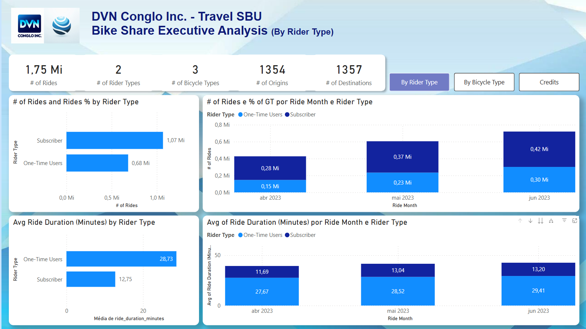
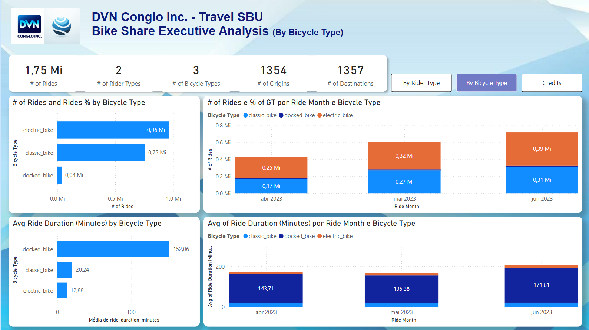
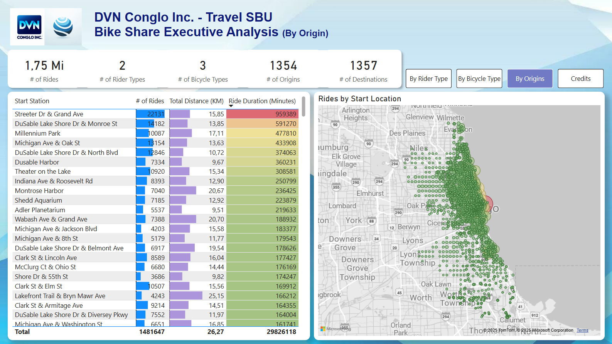
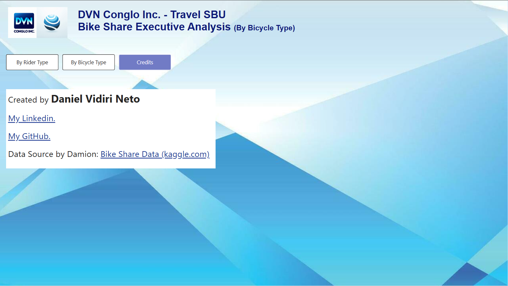

# PORTFÓLIO POWER BI
## Criando um Dashboard de Aluguel de Biciletas em Power BI

---

## **Tecnologias Utilizadas:**

<div style="display: inline_block">
  
  &nbsp;&nbsp;
  
  &nbsp;&nbsp;
  
  &nbsp;&nbsp;
  
</div>

---

## Sobre as Ferramentas Utilizadas

:heavy_check_mark: <b>Git</b><br>
Sistema de Controle de Versão.<br>

:heavy_check_mark: <b>Power BI Desktop</b><br>
Plataforma de Análise de Dados para criar relatórios interativos.<br>

:heavy_check_mark: <b>Microsoft SQL Server 2022</b><br>
Sistema de gerenciamento de banco de dados relacional (RDBMS) que a Microsoft desenvolveu.<br>

:heavy_check_mark: <b>IA Generativa</b><br>
Inteligência Artificial (IA) que usa tecnologia de processamento de linguagem natural para simular conversas e fornecer respostas em texto.<br>

---

## Descrição

- Desenvolvimento de um dashboard de Power BI voltado exclusivamente para fins educacionais, com a utilização de um dataset público.
- Foi criado uma empresa fictícia que faz aluguel de bicicletas.
- Foi utilizado imagens e logos gerados por IA.
- Métricas e KPIs também foram gerados por IA.

---

## Prompt Utilizado pela IA

```
You are an Operations Executive for a Bike Rideshare company.  I have a dataset with specific fields: {Paste fields here}
Can you please provide some metrics or KPIs that you are looking for as an executive that will help you make decisions, plan your year, and make your job easier?  I want to build a dashboard for you and your teams
```

---

## Dataset Utilizado para o Projeto Bike Share Data

### Dataset compartilhado por Damion no Kaggle.com

### [DATASET](https://www.kaggle.com/datasets/derescio/bike-share-data)

---

## Link do Relatório no Power BI Services

### [RELATÓRIO](https://app.powerbi.com/view?r=eyJrIjoiNGE3MDFhY2UtN2QwZi00YzM4LWFlYzItZWJkZTFiNDc4ODMxIiwidCI6IjFmOWE0ZDllLTFmYTAtNGY3My1hOGUwLTcwOTRkNGY3ZGM3MSJ9)

---

## Link do Dashboard no Google Drive para fazer Download

### [DOWNLOAD](https://drive.google.com/drive/folders/1F58Gubpj2V5v2e-2bhu0T1GLPUcVUwKX?usp=sharing)

---

## Imagens

<div align="center">
  
  
  
  
</div>

---

### Repositório relacionado ao portfólio de Power BI
